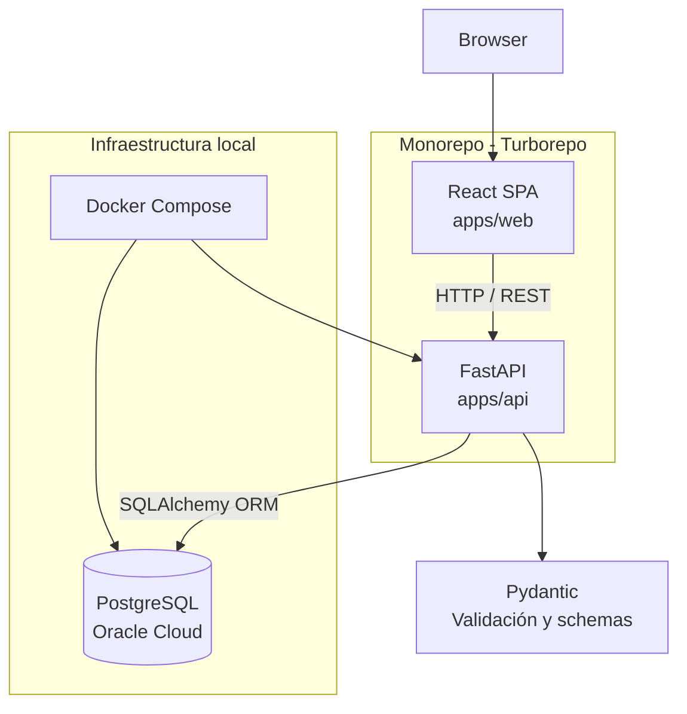

# 🎮 GlyphLog

### Track your anime, manga & games — all in one place


---

## 📖 Descripción

GlyphLog es una aplicación web personal para **registrar, organizar y hacer seguimiento** de animes, mangas y videojuegos. Permite llevar un control centralizado del contenido multimedia que consumes: qué estás viendo, qué has terminado, en qué punto vas y cómo lo valoras.

### Objetivo

El proyecto tiene una doble finalidad:

- **Formativa**: explorar y consolidar conocimientos en un stack moderno full-stack (React + FastAPI + PostgreSQL) dentro de una arquitectura monorepo real.
- **Portfolio**: demostrar capacidad para diseñar, construir y documentar una aplicación web completa, desde la arquitectura hasta el despliegue.

---

## 🛠️ Stack Tecnológico

| Capa | Tecnología |
|---|---|
| **Frontend** | React 18, Vite, TypeScript, Tailwind CSS, shadcn/ui |
| **Backend** | FastAPI, Python 3.11+, Pydantic |
| **Base de datos** | PostgreSQL 15, SQLAlchemy (ORM), Alembic (migraciones) |
| **Infraestructura local** | Docker, Docker Compose |
| **Monorepo** | Turborepo, pnpm workspaces |
| **Despliegue** | Vercel/Netlify (frontend), Railway/Render (backend), Oracle Cloud (BD) |

---

## 🏗️ Arquitectura



---

## 📁 Estructura del Proyecto

```
GlyphLog/
├── apps/
│   ├── web/                  # Frontend — React 18 + Vite + TypeScript
│   │   ├── src/
│   │   │   ├── components/   # Componentes reutilizables (ui/ y shared/)
│   │   │   ├── pages/        # Vistas / rutas (home, collection, login, etc.)
│   │   │   ├── hooks/        # Custom hooks (useAuth, useEntries, etc.)
│   │   │   ├── services/     # Servicios de llamada a la API (auth, entry)
│   │   │   ├── stores/       # Stores globales con Zustand (auth, theme)
│   │   │   ├── lib/          # Clientes y utilidades (api-client, env)
│   │   │   ├── utils/        # Utilidades puras (formatters, errors)
│   │   │   └── types/        # Tipos autogenerados y manuales de TypeScript
│   │   ├── public/
│   │   └── vite.config.ts
│   │
│   └── api/                  # Backend — FastAPI + Python
│       ├── app/
│       │   ├── core/         # Config, seguridad, base de datos y utilidades
│       │   ├── models/       # Modelos SQLAlchemy
│       │   ├── schemas/      # Schemas Pydantic In/Out
│       │   ├── repositories/ # Queries SQL y persistencia a BD
│       │   ├── services/     # Lógica de negocio (casos de uso)
│       │   ├── routers/      # Enpoints e interfaces HTTP
│       │   └── main.py       # Entrada de la app FastAPI
│       ├── alembic/          # Migraciones de base de datos
│       └── requirements.txt
│
├── docs/
│   ├── architecture/         # Documentación de diseño y decisiones técnicas (ADRs)
│   └── tasks/                # Tareas del backlog y guías de configuración
│
├── memory-bank/              # Contexto persistente para desarrollo asistido por IA
│   ├── project-context.md    # Estado actual y alcance del proyecto
│   ├── decisions.md          # Historial de decisiones de arquitectura (ADRs)
│   └── patterns.md           # Patrones de desarrollo y convenciones
│
├── docker-compose.yml        # Infraestructura local (PostgreSQL)
├── turbo.json                # Configuración de Turborepo
├── pnpm-workspace.yaml       # Configuración de pnpm workspaces
├── AGENTS.md                 # Guía para asistentes IA
└── README.md
```

---

## ✅ Requisitos Previos

Asegúrate de tener instaladas las siguientes herramientas antes de continuar:

| Herramienta | Versión mínima | Verificar |
|---|---|---|
| Node.js | >= 20 | `node --version` |
| pnpm | >= 9 | `pnpm --version` |
| Docker | >= 24 | `docker --version` |
| Docker Compose | >= 2.20 | `docker compose version` |
| Python | >= 3.11 | `python3 --version` |
| Git | >= 2.40 | `git --version` |

---

## 🚀 Instalación y Setup

### 1. Clonar el repositorio

```bash
git clone https://github.com/marmedsan6/GlyphLog.git
cd GlyphLog
```

### 2. Instalar dependencias del monorepo

```bash
pnpm install
```

### 3. Configurar variables de entorno

```bash
# Variables del frontend
cp apps/web/.env.example apps/web/.env.local

# Variables del backend
cp apps/api/.env.example apps/api/.env
```

Edita los archivos `.env` con tus valores locales. Consulta los comentarios dentro de cada archivo para más información.

### 4. Levantar los servicios con Docker Compose

```bash
# Inicia la base de datos PostgreSQL local
docker compose up -d
```

Verifica que los servicios estén corriendo:

```bash
docker compose ps
```

### 5. Instalar dependencias Python (entorno virtual)

El proyecto utiliza `uv` para una gestión rápida y eficiente de dependencias en el backend:

```bash
cd apps/api
uv venv
source .venv/bin/activate      # En Windows: .venv\Scripts\activate
uv pip install -r requirements.txt -r requirements-dev.txt
```

### 6. Aplicar migraciones de base de datos

```bash
# Desde apps/api, con el venv activo
alembic upgrade head
```

### 7. Iniciar el frontend y backend en modo desarrollo

```bash
# Desde la raíz del monorepo
pnpm dev
```

La aplicación estará disponible en `http://localhost:5173` y la API en `http://localhost:8000`.

---

## ⚡ Comandos Disponibles

### Turborepo (desde la raíz)

| Comando | Descripción |
|---|---|
| `pnpm dev` | Inicia todos los servicios en modo desarrollo |
| `pnpm build` | Compila todos los paquetes para producción |
| `pnpm lint` | Ejecuta el linter en todos los paquetes |
| `pnpm test` | Ejecuta los tests en todos los paquetes |
| `pnpm clean` | Elimina los artefactos de build (`dist/`, `.turbo/`) |

### Docker Compose

| Comando | Descripción |
|---|---|
| `docker compose up -d` | Levanta los servicios de infraestructura (PostgreSQL) en segundo plano |
| `docker compose down` | Detiene y elimina los contenedores de base de datos |
| `docker compose logs -f` | Muestra los logs en tiempo real |
| `docker compose ps` | Lista el estado de los servicios |

---

## 🗺️ Roadmap

### ✅ Fase 0 — Setup
- [x] Definición de arquitectura y stack
- [x] Configuración del monorepo con Turborepo
- [x] Estructura base del proyecto
- [x] Docker Compose con PostgreSQL
- [x] Scaffolding inicial de `apps/web` y `apps/api`
- [x] CI básico

### ✅ Fase 1 — MVP
- [x] Registro e inicio de sesión local (JWT)
- [x] Google OAuth: integración en frontend y backend (popup consent screen)
- [x] CRUD completo de entradas: anime, manga, videojuego (incluyendo campos opcionales)
- [x] Subida, actualización y eliminación de imágenes de portada
- [x] Interfaz de colección paginada con filtros interactivos

### 🔲 Fase 2 — Progreso (Próxima)
- [ ] Tracking de progreso detallado (episodio actual, capítulo, horas de juego)
- [ ] Historial de actualizaciones por entrada

### 🔲 Fase 3 — Enriquecimiento
- [ ] Tags y categorías personalizadas
- [ ] Reseñas privadas y valoraciones avanzadas

### 🔲 Fase 4 — Mejoras UX & Analytics
- [ ] Estadísticas personales (dashboard visual de consumo)
- [ ] Exportación completa de datos de la colección

---

## 📐 Decisiones Técnicas

Las decisiones de arquitectura del proyecto están documentadas como ADRs (Architecture Decision Records) en [`docs/architecture/`](./docs/architecture/).

Resumen de las decisiones más relevantes:

- **SPA en lugar de SSR**: la aplicación es de uso personal y no requiere SEO, por lo que una SPA con React + Vite es suficiente y más sencilla de desplegar estáticamente.
- **FastAPI sobre Django/Flask**: mejor soporte nativo para OpenAPI/Swagger, validación con Pydantic y rendimiento asíncrono.
- **PostgreSQL sobre SQLite**: se prevé despliegue en Oracle Cloud (instancia gratuita) con PostgreSQL; usar la misma base de datos en desarrollo evita inconsistencias.
- **Monorepo con Turborepo**: facilita la gestión de dependencias compartidas y la ejecución de tareas en paralelo a medida que el proyecto crece.

---

## 🤖 Trabajo con IA

Resumen de las herramientas para agentes IA en el proyecto:

- [`AGENTS.md`](./AGENTS.md): instrucciones y convenciones para agentes IA que trabajen en el proyecto (convenciones de código, arquitectura).
- [`memory-bank/`](./memory-bank/): contexto persistente del proyecto (brief, contexto técnico, decisiones activas, progreso) para mantener coherencia entre sesiones de trabajo con IA.

Si utilizas un agente IA en este proyecto, lee `AGENTS.md` primero.

---

## 📄 Licencia

Este proyecto está bajo la licencia [MIT](./LICENSE).

---

<p align="center">
  Hecho con ☕ por <a href="https://github.com/marmedsan6">mariobox</a>
</p>).
- [`memory-bank/`](./memory-bank/): contexto persistente del proyecto (brief, contexto técnico, decisiones activas, progreso) para mantener coherencia entre sesiones de trabajo con IA.

Si utilizas un agente IA en este proyecto, lee `AGENTS.md` primero.

---

## 📄 Licencia

Este proyecto está bajo la licencia [MIT](./LICENSE).

---

<p align="center">
  Hecho con ☕ y demasiadas horas de anime por <a href="https://github.com/tu-usuario">tu-usuario</a>
</p>
