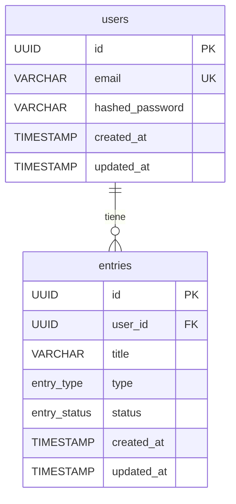

# Esquema de Base de Datos

## Herramientas

| Herramienta | Rol |
|---|---|
| PostgreSQL | Motor de base de datos relacional |
| SQLAlchemy 2.x | ORM para definir modelos y ejecutar queries en Python |
| Alembic | Gestión de migraciones incrementales del esquema |

---

## Diagrama ER — MVP



---

## Descripción de tablas

### `users`

Almacena las cuentas de usuario de la aplicación.

| Columna | Tipo | Restricciones | Descripción |
|---|---|---|---|
| `id` | `UUID` | PK, default `gen_random_uuid()` | Identificador único del usuario |
| `email` | `VARCHAR(255)` | NOT NULL, UNIQUE | Dirección de email, usada como identificador de login |
| `hashed_password` | `VARCHAR(255)` | NOT NULL | Contraseña hasheada con bcrypt (nunca en texto plano) |
| `created_at` | `TIMESTAMP WITH TIME ZONE` | NOT NULL, default `now()` | Fecha y hora de creación del registro |
| `updated_at` | `TIMESTAMP WITH TIME ZONE` | NOT NULL, default `now()` | Fecha y hora de última modificación (se actualiza automáticamente) |

### `entries`

Almacena cada ítem registrado en la colección de un usuario (anime, manga o videojuego).

| Columna | Tipo | Restricciones | Descripción |
|---|---|---|---|
| `id` | `UUID` | PK, default `gen_random_uuid()` | Identificador único de la entrada |
| `user_id` | `UUID` | NOT NULL, FK → `users.id` ON DELETE CASCADE | Usuario propietario de la entrada |
| `title` | `VARCHAR(500)` | NOT NULL | Título del anime, manga o videojuego |
| `type` | `entry_type` (enum) | NOT NULL | Tipo de entrada: `anime`, `manga` o `game` |
| `status` | `entry_status` (enum) | NOT NULL | Estado actual de seguimiento |
| `created_at` | `TIMESTAMP WITH TIME ZONE` | NOT NULL, default `now()` | Fecha y hora de creación del registro |
| `updated_at` | `TIMESTAMP WITH TIME ZONE` | NOT NULL, default `now()` | Fecha y hora de última modificación |

---

## Enums

### `entry_type`

Define el tipo de contenido que representa una entrada.

| Valor | Descripción |
|---|---|
| `anime` | Serie o película de animación japonesa |
| `manga` | Cómic o novela gráfica japonesa |
| `game` | Videojuego |

### `entry_status`

Define el estado de seguimiento de una entrada.

| Valor | Descripción |
|---|---|
| `watching` | En progreso (viendo / leyendo / jugando) |
| `completed` | Finalizado |
| `on_hold` | En pausa |
| `dropped` | Abandonado |
| `plan_to_watch` | Pendiente (en la lista de "quiero ver/leer/jugar") |

Los enums se definen como tipos nativos de PostgreSQL y como `Enum` de Python usando SQLAlchemy para mantener consistencia en ambas capas.

---

## Índices previstos

| Tabla | Columna(s) | Tipo | Justificación |
|---|---|---|---|
| `users` | `email` | UNIQUE INDEX | Garantiza unicidad y acelera el lookup en login |
| `entries` | `user_id` | INDEX | Acelera el filtrado de entradas por usuario (consulta más frecuente) |

---

## Estrategia de migraciones con Alembic

Alembic gestiona los cambios de esquema de forma incremental. Cada cambio genera un archivo de migración versionado que puede aplicarse hacia adelante (`upgrade`) o deshacerse (`downgrade`).

### Comandos principales

```bash
# Desde apps/api/

# Generar una nueva migración automáticamente comparando modelos con el esquema actual
alembic revision --autogenerate -m "descripcion_corta_del_cambio"

# Aplicar todas las migraciones pendientes
alembic upgrade head

# Deshacer la última migración
alembic downgrade -1

# Ver el historial de migraciones
alembic history --verbose

# Ver la revisión actual aplicada en la BD
alembic current
```

### Convención de nombres para migraciones

El mensaje de revisión debe ser descriptivo y seguir el formato `verbo_sustantivo`:

```
create_users_table
add_status_column_to_entries
add_index_entries_user_id
rename_type_to_entry_type
```

Alembic genera el nombre del archivo con el formato `<timestamp>_<mensaje>.py`, por ejemplo: `2024_01_15_1430_create_users_table.py`.

### Regla importante

Nunca modificar manualmente una migración ya aplicada en producción. Si se necesita corregir un error, generar una nueva migración que aplique la corrección.
