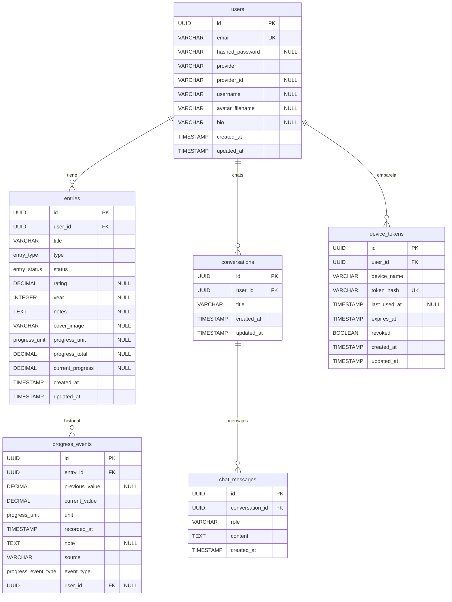

# Esquema de Base de Datos

## Herramientas

| Herramienta | Rol |
|---|---|
| PostgreSQL | Motor de base de datos relacional |
| SQLAlchemy 2.x | ORM para definir modelos y ejecutar queries en Python |
| Alembic | Gestión de migraciones incrementales del esquema |

---

## Diagrama ER



---

## Descripción de tablas

### `users`

Almacena las cuentas de usuario. Admite registro/login local y login social (Google OAuth), además de perfil público.

| Columna | Tipo | Restricciones | Descripción |
|---|---|---|---|
| `id` | `UUID` | PK, default `uuid4()` | Identificador único del usuario |
| `email` | `VARCHAR(255)` | NOT NULL, UNIQUE, INDEX | Dirección de email, usada como identificador de login |
| `hashed_password` | `VARCHAR(255)` | NULL | Contraseña hasheada con bcrypt (NULL para usuarios OAuth) |
| `provider` | `VARCHAR(20)` | NOT NULL, default `'local'` | Proveedor de identidad: `'local'`, `'google'`, etc. |
| `provider_id` | `VARCHAR(255)` | NULL | ID único en el proveedor OAuth (`sub` de Google) |
| `username` | `VARCHAR(20)` | NULL, único case-insensitive | Identidad pública; se guarda en minúsculas |
| `avatar_filename` | `VARCHAR(255)` | NULL | Nombre del avatar subido en `/uploads/avatars/` (NULL = avatar DiceBear) |
| `bio` | `VARCHAR(500)` | NULL | Biografía pública opcional |
| `created_at` | `TIMESTAMPTZ` | NOT NULL, default `now()` | Fecha de creación |
| `updated_at` | `TIMESTAMPTZ` | NOT NULL, default `now()` | Última modificación |

### `entries`

Almacena cada ítem registrado en la colección de un usuario (anime, manga o videojuego), con su configuración de progreso.

| Columna | Tipo | Restricciones | Descripción |
|---|---|---|---|
| `id` | `UUID` | PK, default `uuid4()` | Identificador único |
| `user_id` | `UUID` | NOT NULL, FK → `users.id` ON DELETE CASCADE | Usuario propietario |
| `title` | `VARCHAR(500)` | NOT NULL | Título del anime, manga o videojuego |
| `type` | `entry_type` (enum) | NOT NULL | `anime`, `manga` o `game` |
| `status` | `entry_status` (enum) | NOT NULL | Estado de seguimiento |
| `rating` | `NUMERIC(3,1)` | NULL | Puntuación 1.0–10.0 |
| `year` | `INTEGER` | NULL | Año de publicación |
| `notes` | `TEXT` | NULL | Notas personales |
| `cover_image` | `VARCHAR(500)` | NULL | Ruta relativa de la portada |
| `progress_unit` | `progress_unit` (enum) | NULL | Unidad de progreso (derivada del tipo, ADR-009) |
| `progress_total` | `NUMERIC(10,2)` | NULL, CHECK `>= 0` | Total objetivo de progreso |
| `current_progress` | `NUMERIC(10,2)` | NULL, CHECK `>= 0` | Progreso actual |
| `created_at` | `TIMESTAMPTZ` | NOT NULL, default `now()` | Fecha de creación |
| `updated_at` | `TIMESTAMPTZ` | NOT NULL, default `now()` | Última modificación |

### `progress_events`

Historial inmutable de cambios de progreso (ADR-008). Cada evento documenta el valor previo y el posterior.

| Columna | Tipo | Restricciones | Descripción |
|---|---|---|---|
| `id` | `UUID` | PK, default `uuid4()` | Identificador único |
| `entry_id` | `UUID` | NOT NULL, FK → `entries.id` ON DELETE CASCADE | Entrada asociada |
| `previous_value` | `NUMERIC(10,2)` | NULL | Valor previo al evento |
| `current_value` | `NUMERIC(10,2)` | NOT NULL | Valor posterior al evento |
| `unit` | `progress_unit` (enum) | NOT NULL | Unidad del evento |
| `recorded_at` | `TIMESTAMPTZ` | NOT NULL, default `now()` | Momento del evento |
| `note` | `TEXT` | NULL | Nota opcional (motivo de reset) |
| `source` | `VARCHAR(50)` | NOT NULL, default `'web'` | Origen: `web`, `browser_extension`, `import`, etc. |
| `event_type` | `progress_event_type` (enum) | NOT NULL | `update` o `reset` |
| `user_id` | `UUID` | NULL, FK → `users.id` ON DELETE SET NULL | Usuario que registró el evento |

### `conversations` y `chat_messages`

Persistencia de conversaciones de GlyphAI (issue #45). El mensaje `system` no se persiste: se reconstruye en cada request con el contexto RAG.

| Tabla | Columna | Tipo | Descripción |
|---|---|---|---|
| `conversations` | `id` | `UUID` PK | Identificador del hilo |
| | `user_id` | `UUID` FK → `users.id` | Propietario |
| | `title` | `VARCHAR(255)` | Título auto-generado |
| `chat_messages` | `id` | `UUID` PK | Identificador del mensaje |
| | `conversation_id` | `UUID` FK → `conversations.id` | Hilo asociado |
| | `role` | `VARCHAR` | `user` o `assistant` |
| | `content` | `TEXT` | Contenido del mensaje |

### `device_tokens`

Tokens de acceso limitado para dispositivos externos (extensión Chrome, ADR-011). El token se almacena hasheado (SHA-256) y solo se muestra en texto plano una vez durante la activación.

| Columna | Tipo | Restricciones | Descripción |
|---|---|---|---|
| `id` | `UUID` | PK | Identificador |
| `user_id` | `UUID` | FK → `users.id` ON DELETE CASCADE | Propietario |
| `device_name` | `VARCHAR(50)` | NOT NULL | Nombre descriptivo |
| `token_hash` | `VARCHAR(64)` | NOT NULL, UNIQUE | SHA-256 del token (nunca el token plano) |
| `last_used_at` | `TIMESTAMPTZ` | NULL | Último uso |
| `expires_at` | `TIMESTAMPTZ` | NOT NULL | Expiración (90 días, renovable con uso) |
| `revoked` | `BOOLEAN` | NOT NULL | Si fue revocado manualmente |

---

## Enums

### `entry_type`

| Valor | Descripción |
|---|---|
| `anime` | Serie o película de animación japonesa |
| `manga` | Cómic o novela gráfica japonesa |
| `game` | Videojuego |

### `entry_status`

| Valor | Descripción |
|---|---|
| `watching` | En progreso (viendo / leyendo / jugando) |
| `completed` | Finalizado |
| `on_hold` | En pausa |
| `dropped` | Abandonado |
| `plan_to_watch` | Pendiente |

### `progress_unit`

| Valor | Descripción |
|---|---|
| `episodes` | Unidad fija para `anime` |
| `chapters` | Unidad fija para `manga` |
| `hours` | Unidad fija para `game` |
| `volumes`, `minutes`, `percentage` | Obsoletos para entradas nuevas; se conservan por compatibilidad con datos históricos (ADR-009) |

### `progress_event_type`

| Valor | Descripción |
|---|---|
| `update` | Cambio manual de progreso |
| `reset` | Reinicio explícito de progreso |

---

## Índices y Restricciones de Unicidad

| Tabla | Índice / Restricción | Columnas | Tipo | Justificación |
|---|---|---|---|---|
| `users` | `ix_users_email` | `email` | UNIQUE INDEX | Lookup en login |
| `users` | `ix_users_provider_provider_id` | `provider`, `provider_id` | UNIQUE PARTIAL INDEX | Unicidad de cuentas OAuth (`provider_id IS NOT NULL`) |
| `users` | `ix_users_username_lower` | `lower(username)` | UNIQUE INDEX | Unicidad case-insensitive del username |
| `entries` | `uq_entries_user_title_type` | `user_id`, `title`, `type` | UNIQUE CONSTRAINT | Evita duplicados del mismo tipo |
| `entries` | `ix_entries_user_id_created_at` | `user_id`, `created_at` | COMPOSITE INDEX | Listados paginados ordenados por fecha |
| `entries` | `ix_entries_user_id` | `user_id` | INDEX | Búsquedas por usuario |
| `progress_events` | `ix_progress_events_entry_id_recorded_at` | `entry_id`, `recorded_at` | COMPOSITE INDEX | Historial ordenado y detección rápida de historial |

---

## Estrategia de migraciones con Alembic

Alembic gestiona los cambios de esquema de forma incremental. Cada cambio genera un archivo de migración versionado que puede aplicarse hacia adelante (`upgrade`) o deshacerse (`downgrade`).

### Comandos principales

```bash
# Desde apps/api/

# Generar una nueva migración automáticamente comparando modelos con el esquema actual
alembic revision --autogenerate -m "descripcion_corta_del_cambio"

# Aplicar todas las migraciones pendientes
alembic upgrade head

# Deshacer la última migración
alembic downgrade -1

# Ver el historial de migraciones
alembic history --verbose

# Ver la revisión actual aplicada en la BD
alembic current
```

### Convención de nombres

El mensaje de revisión debe ser descriptivo y en `snake_case`: `add_status_column_to_entries`. Alembic genera el nombre del archivo con formato `<timestamp>_<mensaje>.py`.

### Regla importante

Nunca modificar manualmente una migración ya aplicada en producción. Si se necesita corregir un error, generar una nueva migración que aplique la corrección.
