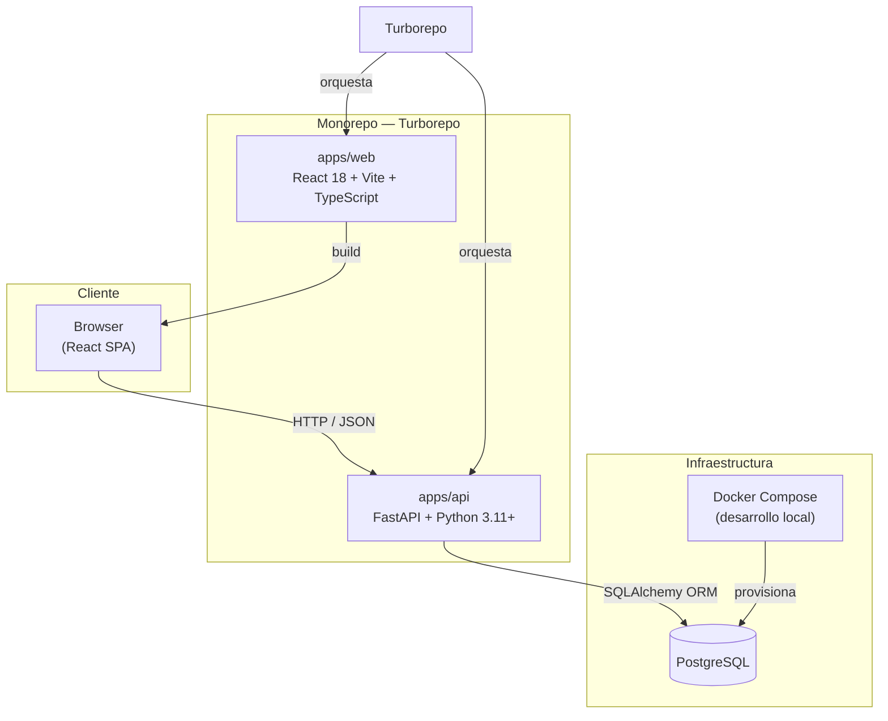

# Visión General de la Arquitectura

## Resumen

GlyphLog sigue una arquitectura **cliente-servidor desacoplada**. El frontend es una SPA (Single Page Application) que se comunica con el backend a través de una API REST. Ambas aplicaciones conviven en un **monorepo gestionado con Turborepo**, lo que permite cacheo de builds, pipelines de CI unificados y una experiencia de desarrollo coherente.

Para el entorno de desarrollo local, **Docker Compose** levanta los servicios de infraestructura (PostgreSQL), mientras que frontend y backend corren directamente en el host con sus servidores de desarrollo nativos.

---

## Diagrama principal

---

## Decisiones arquitectónicas principales

| Decisión | Alternativa considerada | Razón |
|---|---|---|
| SPA (React + Vite) | SSR con Next.js | App personal sin requisitos de SEO. El despliegue estático es gratuito en Vercel/Netlify y simplifica la infraestructura. |
| FastAPI | Django REST Framework, Express | Ecosistema Python, tipado nativo con Pydantic, documentación OpenAPI automática y rendimiento asíncrono sin configuración extra. |
| PostgreSQL | SQLite, MySQL | Robustez para datos relacionales estructurados, soporte completo de enums y UUID, y disponibilidad gratuita en Oracle Cloud Always Free. |
| Turborepo | Nx, scripts manuales | Cacheo inteligente de tareas, definición declarativa de pipelines y excelente DX sin configuración excesiva. |
| Docker Compose (solo dev) | Docker en producción también | Simplifica el entorno local sin añadir complejidad operacional. Producción usa PaaS gestionados. |

---

## Flujo de datos típico

---

## Principios de diseño

- **Separación de responsabilidades**: el frontend no contiene lógica de negocio; el backend no genera HTML.
- **Contrato explícito**: la API define tipos estrictos con Pydantic; el frontend los refleja con TypeScript.
- **Sin over-engineering**: no se añaden abstracciones hasta que el problema concreto las justifica.
- **Desplegable independientemente**: frontend y backend pueden desplegarse y escalarse por separado.
- **Entorno reproducible**: cualquier desarrollador puede levantar el proyecto con `docker compose up` + `pnpm dev`.
