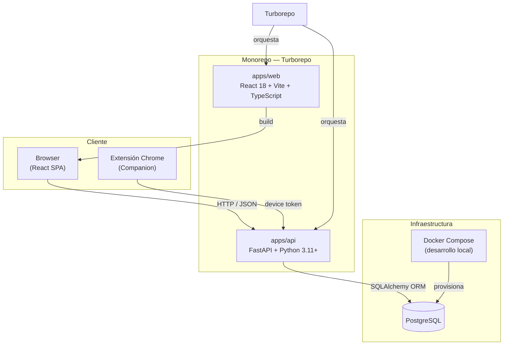
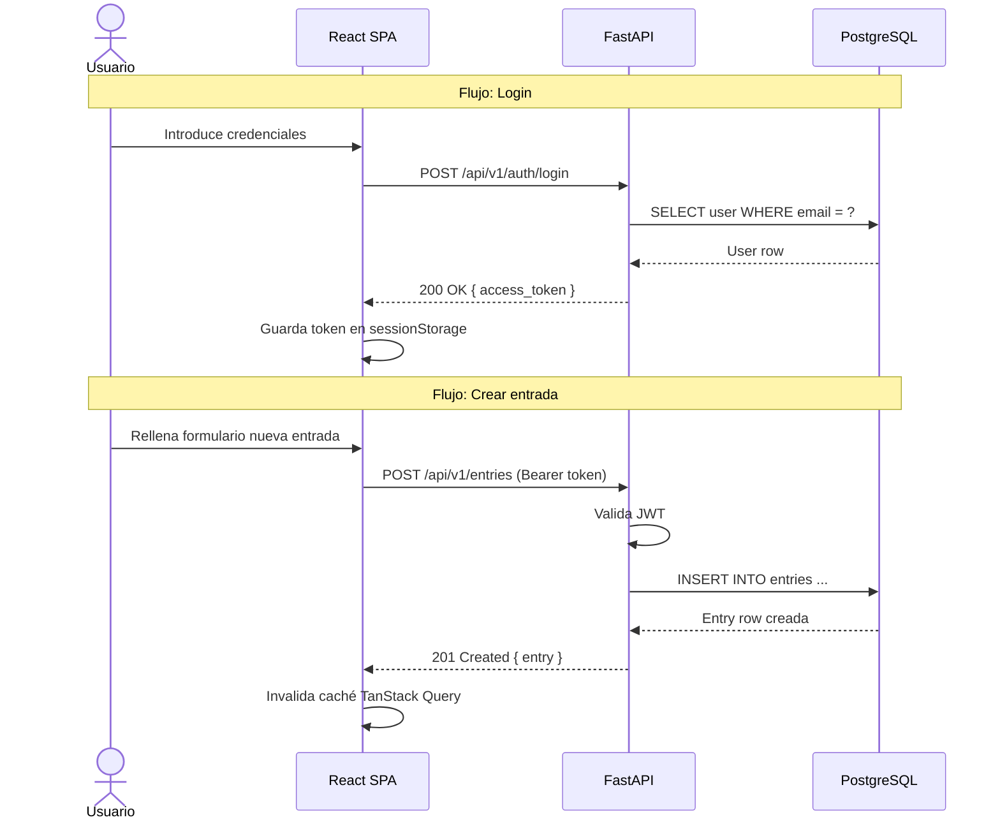

# Visión General de la Arquitectura

## Resumen

GlyphLog sigue una arquitectura **cliente-servidor desacoplada**. El frontend es una SPA (Single Page Application) que se comunica con el backend a través de una API REST. Ambos conviven en un **monorepo gestionado con Turborepo**, lo que permite cacheo de builds, pipelines de CI unificados y una experiencia de desarrollo coherente.

Además de la SPA y la API, el monorepo incluye una **extensión de Chrome** (`apps/extension`, GlyphLog Companion) que consume la API autenticándose con device tokens.

Para el desarrollo local, **Docker Compose** levanta PostgreSQL; frontend y backend corren directamente en el host con sus servidores de desarrollo nativos.

---

## Diagrama principal

---

## Decisiones arquitectónicas principales

| Decisión | Alternativa considerada | Razón |
|---|---|---|
| SPA (React + Vite) | SSR con Next.js | App personal sin requisitos de SEO; despliegue estático simple. |
| FastAPI | Django REST Framework, Express | Ecosistema Python, tipado con Pydantic, OpenAPI automático, asíncrono. |
| PostgreSQL | SQLite, MySQL | Robustez relacional, enums y UUID, disponibilidad gratuita en Oracle Cloud. |
| Turborepo | Nx, scripts manuales | Cacheo de tareas, pipelines declarativos, DX sin complejidad. |
| Docker Compose (solo dev) | Docker en producción | Simplifica el entorno local. Producción usa VM + Nginx + Cloudflare. |
| Router → Service → Repository | Queries en router | Separación de responsabilidades y testeabilidad (ADR-001/ADR-008). |

---

## Flujo de datos típico

---

## Principios de diseño

- **Separación de responsabilidades**: el frontend no contiene lógica de negocio; el backend no genera HTML.
- **Contrato explícito**: la API define tipos estrictos con Pydantic; el frontend los refleja con TypeScript (tipos OpenAPI regenerados).
- **Sin over-engineering**: no se añaden abstracciones hasta que el problema concreto las justifica.
- **Desplegable independientemente**: frontend y backend pueden desplegarse y escalarse por separado.
- **Entorno reproducible**: cualquier desarrollador puede levantar el proyecto con `docker compose up` + `pnpm dev`.
