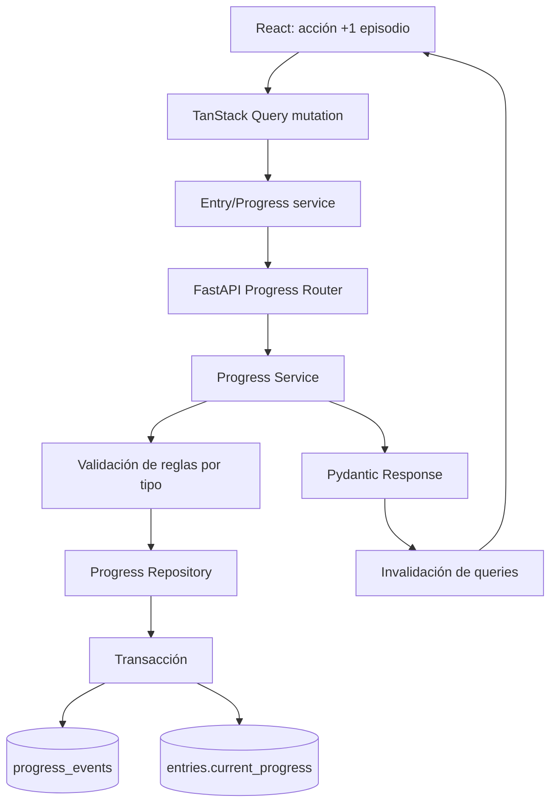

# Plan de Evolución para GlyphLog

> **Estado**: Plan estratégico a largo plazo  
> **Última actualización**: Julio 2026  
> **Fuente de verdad**: GitHub Project #2 (backlog activo)

---

## 1. Diagnóstico actual

GlyphLog ya no está en fase de setup: dispone de autenticación local y Google OAuth, CRUD completo, portadas, búsqueda, ordenamiento, catálogos externos, modo oscuro, despliegue productivo y **210 tests passing**.

### Puntos de mantenimiento identificados

1. **Backlog desactualizado**: `T-018` sigue pendiente en documentación, aunque búsqueda y filtros ya están implementados. ✅ **Resuelto**: backlog local eliminado, GitHub Projects es ahora la fuente única.
2. **README desfasado**: todavía presenta la fase de setup como actual y no refleja las funcionalidades desplegadas.
3. **Decisiones pendientes importantes**:
   - Modelado del progreso.
   - Recuperación de contraseña.
   - Estrategia E2E.
   - Evolución de JWT hacia refresh tokens seguros.

### Conclusión del diagnóstico

El siguiente salto no debería ser "añadir más campos", sino convertir GlyphLog en una herramienta que ayude al usuario a **entender y mantener sus hábitos de consumo**.

---

## 2. Criterios para elegir funcionalidades

Cada iniciativa se puntúa de 1 a 5 usando:

| Criterio | Pregunta |
|---|---|
| Valor de usuario | ¿Resuelve un problema frecuente? |
| Diferenciación | ¿Hace que GlyphLog destaque frente a un CRUD común? |
| Valor de portfolio | ¿Demuestra diseño, arquitectura y testing? |
| Viabilidad | ¿Puede entregarse incrementalmente? |
| Reutilización | ¿Desbloquea otras funcionalidades? |

**Fórmula de priorización:**

```text
Prioridad = valor + diferenciación + portfolio + reutilización - complejidad
```

No es una fórmula científica; sirve para justificar decisiones y evitar construir funcionalidades solo porque parecen atractivas.

---

## 3. Roadmap propuesto

### Fase A — Consolidación y calidad

Antes de crear features complejas:

#### A1. Sincronizar documentación y backlog

- ✅ Eliminar backlog local (completado).
- Actualizar el roadmap del `README.md`.
- Eliminar contradicciones sobre la fase actual.
- Revisar las tareas reales del GitHub Project #2.
- Crear tareas usando `docs/tasks/TEMPLATE.md`.

#### A2. Baseline de calidad de producto

- E2E de los flujos críticos:
  - Registro/login.
  - Login con Google.
  - Crear, editar y eliminar una entrada.
  - Buscar y ordenar.
  - Cerrar sesión y comprobar aislamiento de caché.
- Auditoría de accesibilidad con axe o Playwright.
- Métricas de rendimiento con Lighthouse.
- Logging estructurado y correlación de errores backend.
- CI que ejecute `pytest`, Vitest, ESLint, Ruff, Mypy y build.

#### A3. Seguridad post-MVP

- Access token corto en memoria.
- Refresh token rotatorio en cookie `httpOnly`.
- Revocación de sesiones.
- Recuperación de contraseña con token de un solo uso.
- CSP y headers de seguridad.
- Rate limiting distribuido si se escala a más de una instancia.

**Motivo:** aumentar primero la confianza del sistema evita que las nuevas features crezcan sobre deuda operativa.

---

### Fase B — Progreso como núcleo del dominio

#### B1. Seguimiento de progreso por tipo

Permitir registrar:

- Anime: episodio actual / episodios totales.
- Manga: capítulo o volumen actual / total.
- Juego: horas jugadas y porcentaje estimado.
- Opcionalmente, unidad personalizada cuando el catálogo no proporcione totales.

**Decisión recomendada:**

No guardar solamente `current_progress` en `entries`. Crear un historial inmutable:

```text
progress_events
- id
- entry_id
- user_id
- previous_value
- current_value
- unit
- recorded_at
- note
```

La entrada conserva un valor actual denormalizado para listados rápidos, mientras `progress_events` mantiene la historia completa.

**Alternativas evaluadas:**

- **Solo campos en `entries`**: sencillo, pero elimina el historial y limita futuras estadísticas.
- **Una tabla diferente para cada tipo**: modelado estricto, pero introduce demasiada complejidad prematura.
- **Evento genérico + valor actual denormalizado**: equilibrio recomendado.

#### B2. Registro rápido

Desde cada tarjeta:

- `+1 episodio`
- `+1 capítulo`
- `+30 min`
- "Marcar como completado"

Debe funcionar sin entrar en la página de detalle. Es una mejora pequeña con mucho impacto cotidiano.

#### B3. Historial o diario de actividad

Timeline con eventos como:

```text
Hoy
• Frieren: episodio 12 → 13
• Berserk: añadida una nota
• Hollow Knight: +1,5 horas
```

Esto convierte la aplicación de un inventario estático en un **diario personal de consumo**.

---

### Fase C — "GlyphPulse": continuidad inteligente

Esta sería la primera funcionalidad realmente diferenciadora.

#### C1. Panel "¿Qué continúo hoy?"

Una vista que ordene las entradas en progreso usando señales explicables:

- Última actividad.
- Progreso pendiente.
- Estado actual.
- Frecuencia habitual.
- Entradas abandonadas recientemente.
- Preferencias por tipo.

No necesita IA generativa. Puede comenzar con reglas deterministas:

```text
score =
  recency_weight
  + active_status_weight
  + near_completion_bonus
  - inactivity_penalty
```

La interfaz debe explicar el resultado:

> "Te sugerimos continuar esta entrada porque estás al 80% y la actualizaste hace tres días."

#### C2. Detector de entradas estancadas

- "Llevas 30 días sin avanzar."
- Acciones: continuar, pausar, abandonar o archivar.
- Umbral configurable.
- Resumen semanal no invasivo.

#### C3. Objetivos personales

Ejemplos:

- Leer 20 capítulos este mes.
- Completar dos juegos este trimestre.
- Ver tres episodios por semana.
- Reducir entradas en pausa.

Evitar gamificación agresiva. Los objetivos deben fomentar consistencia, no obligación.

---

### Fase D — Inteligencia personal y estadísticas ⚠️ EXPLORATORIA

> **Nota**: Esta fase y las siguientes son exploratorias. Reevaluar después de completar las épicas 1-3. Es mejor tener un tracker con progreso inteligente funcionando bien, que muchas features mediocres.

#### D1. Dashboard accionable

No limitarse a gráficos decorativos. Incluir métricas que respondan preguntas:

- ¿Qué tipo de contenido termino más?
- ¿Cuánto tiempo tardan mis entradas en completarse?
- ¿Qué porcentaje abandono?
- ¿Cuándo suelo registrar más progreso?
- ¿Qué ratings doy por tipo, año o tag?
- ¿Cuántas entradas están estancadas?

#### D2. "Taste Fingerprint"

Perfil privado y explicable de preferencias:

- Tipos predominantes.
- Tags mejor valorados.
- Duración preferida.
- Tendencia a completar o abandonar.
- Épocas o años más consumidos.
- Relación entre duración y puntuación.

Ejemplo:

> "Sueles puntuar mejor mangas cortos de fantasía y terminas más juegos narrativos que mundos abiertos."

El cálculo puede empezar con SQL y reglas; no requiere un modelo de machine learning.

**Preocupación**: Riesgo de sobreingeniería para una app personal. ¿Cuántos datos reales tendrás para que sean útiles?

#### D3. Recomendaciones personales explicables

Cruzar el perfil con los catálogos Jikan y RAWG:

> "Recomendado porque comparte tres tags con tus animes mejor valorados y tiene una duración similar."

Es preferible a una caja negra porque demuestra dominio de producto, datos y explicabilidad.

#### D4. Resumen anual "GlyphLog Replay"

Un informe visual:

- Entradas completadas.
- Horas, episodios y capítulos.
- Mes más activo.
- Mejor puntuación.
- Entrada más larga.
- Mayor racha.
- Distribución por tipo y tags.

Puede exportarse como imagen compartible sin convertir la aplicación en una red social.

---

### Fase E — Organización avanzada ⚠️ EXPLORATORIA

#### E1. Tags y colecciones inteligentes

Además de tags manuales, permitir colecciones dinámicas:

- "Juegos sin terminar con rating alto."
- "Anime corto pendiente."
- "Manga actualizado este mes."
- "Entradas estancadas."
- "Completados en 2026."

Internamente serían filtros guardados, no listas duplicadas.

#### E2. Universos o franquicias ⚠️ RIESGO ALTO

Relacionar entradas pertenecientes al mismo universo:

```text
Fullmetal Alchemist
├── Manga
├── Anime 2003
├── Brotherhood
└── Películas
```

**Preocupación**: Rabbit hole peligroso. Los metadatos externos son inconsistentes y el mantenimiento es alto. Considerar si realmente vale la pena el esfuerzo.

#### E3. Relaciones entre entradas

Relaciones posibles:

- Adaptación de.
- Secuela/precuela.
- Spin-off.
- Mismo universo.
- Recomendación personal.

Conviene implementarlo después de tags y catálogos, porque requiere normalizar metadatos externos.

---

### Fase F — Portabilidad e interoperabilidad ⚠️ EXPLORATORIA

#### F1. Exportación completa

- JSON como formato canónico.
- CSV para análisis.
- Exportación de notas, progreso e historial.
- Descarga desde ajustes de cuenta.

#### F2. Importación con previsualización

- Validar antes de persistir.
- Mostrar duplicados y conflictos.
- Permitir corregir mappings.
- Ejecutar la importación como operación transaccional.

#### F3. Integraciones externas

En orden de dificultad:

1. Importar CSV/JSON propio.
2. Importar desde MyAnimeList o AniList.
3. Sincronización opcional con Steam.
4. Webhooks o API pública personal.

**Preocupación**: Subestimada. MAL/AniList tienen APIs con rate limits y formatos inconsistentes. La sincronización bidireccional implica OAuth adicional, rate limits, conflictos y jobs en background.

---

## 4. Priorización recomendada

| Orden | Iniciativa | Usuario | Diferenciación | Portfolio | Complejidad |
|---:|---|---:|---:|---:|---:|
| 1 | Higiene de backlog, E2E y seguridad | 4 | 2 | 5 | 3 |
| 2 | Progreso + historial de eventos | 5 | 4 | 5 | 4 |
| 3 | Registro rápido desde tarjetas | 5 | 3 | 4 | 2 |
| 4 | GlyphPulse y entradas estancadas | 5 | 5 | 5 | 3 |
| 5 | Dashboard accionable | 4 | 4 | 5 | 3 |
| 6 | Tags y colecciones inteligentes | 4 | 4 | 4 | 3 |
| 7 | Taste Fingerprint | 4 | 5 | 5 | 4 |
| 8 | Exportación/importación | 4 | 3 | 5 | 3 |
| 9 | GlyphLog Replay | 4 | 5 | 4 | 3 |
| 10 | Franquicias y relaciones | 3 | 5 | 5 | 5 |

---

## 5. Primer bloque ejecutable

Las próximas semanas se organizan en tres épicas:

### Épica 1 — Calidad y coherencia

- ✅ Eliminar backlog local (completado).
- Actualizar README.
- Definir estrategia E2E.
- Cubrir tres flujos críticos.
- Diseñar refresh tokens y recuperación de contraseña.
- Registrar las decisiones mediante ADRs.

### Épica 2 — Progress Tracking

- ADR sobre modelado del progreso.
- Migración de `progress_events`.
- Repository y service transaccionales.
- Endpoints para registrar y consultar progreso.
- Controles rápidos en frontend.
- Timeline de actividad.
- Tests de reglas específicas por tipo.

### Épica 3 — GlyphPulse

- Definir algoritmo determinista.
- Endpoint de entradas sugeridas.
- Detector de entradas estancadas.
- Explicación de cada recomendación.
- Dashboard inicial.
- Tests unitarios del scoring.

---

## 6. Flujo arquitectónico recomendado



**Regla principal:**

- **Router**: valida formato y autenticación.
- **Service**: comprueba retrocesos, límites, estados y transiciones.
- **Repository**: actualiza la entrada y crea el evento en una misma transacción.
- **Base de datos**: conserva el estado actual y el historial.
- **Frontend**: invalida colección, detalle, timeline y dashboard.

---

## 7. Resultado estratégico

La propuesta posiciona GlyphLog en tres niveles:

1. **Tracker funcional**: CRUD, búsqueda y progreso.
2. **Diario personal**: historial, notas y resumen temporal.
3. **Asistente explicable**: continuidad, hábitos, recomendaciones y retrospectivas.

**Apuesta diferenciadora:**

> **Historial de progreso + GlyphPulse + Taste Fingerprint**

Es más original y defendible que limitarse a replicar MyAnimeList, Backloggd o Goodreads.

---

## 8. Consideraciones y riesgos

### Ambición vs realidad

Este plan representa ~12-18 meses de trabajo para un dev solo. Las fases D-F son "nice to have" que podrían nunca llegar. **Está bien.** Es mejor ejecutar bien las fases A-C que tener muchas features mediocres.

### Riesgos identificados

1. **Taste Fingerprint y Replay**: Riesgo de sobreingeniería para una app personal. Evaluar si hay suficientes datos reales para que sean útiles antes de implementar.

2. **Franquicias/relaciones (E2-E3)**: Rabbit hole peligroso. Los metadatos externos son inconsistentes y el mantenimiento es alto. Considerar si el ROI justifica el esfuerzo.

3. **Importación desde MAL/AniList (F3)**: Subestimada. APIs con rate limits, formatos inconsistentes, y la sincronización bidireccional añade complejidad significativa.

### Recomendación final

Ejecuta las épicas 1-3 (calidad, progreso, GlyphPulse) como planeas. Luego **revalúa** antes de comprometerte con D-F. Trata las fases D-F como exploratorias, no comprometidas.

---

## 9. Preguntas de Entrevista: ¿Cómo defender esto?

### 1. ¿Por qué utilizar una tabla de eventos y mantener también el progreso actual?

El historial de eventos permite auditoría, estadísticas y reconstrucción temporal. Mantener el progreso actual denormalizado evita agregar todos los eventos en cada listado. El coste es asegurar consistencia, que se resuelve actualizando ambos registros dentro de una transacción.

### 2. ¿Por qué empezar las recomendaciones con reglas en lugar de machine learning?

Porque todavía no existe suficiente volumen de datos por usuario. Un algoritmo determinista es barato, testeable y explicable. Cuando haya datos reales, se puede evaluar un modelo más sofisticado sin cambiar necesariamente el contrato de la API.

### 3. ¿Cómo impedirías que un dashboard afecte al rendimiento?

Mediante índices adecuados, agregaciones SQL, rangos temporales acotados y caché por usuario. Si las consultas crecen, se pueden introducir snapshots o jobs asíncronos. No conviene materializar estadísticas antes de observar problemas reales.

---

**Nota**: Este documento es un plan estratégico, no un compromiso. Las prioridades pueden cambiar según el aprendizaje durante la implementación. GitHub Project #2 es la fuente de verdad para tareas activas.
