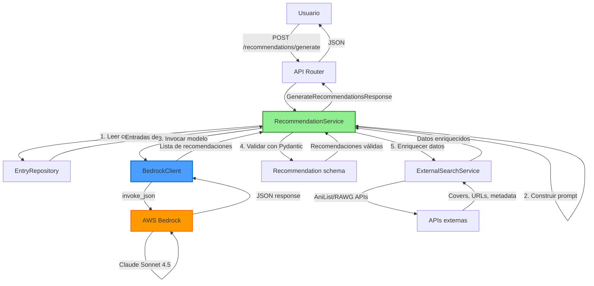

# Sistema de Recomendaciones con Claude

## Overview

GlyphLog utiliza Claude Sonnet 4.5 (AWS Bedrock) para analizar la colección personal del usuario y generar recomendaciones personalizadas de animes, mangas y videojuegos. Este sistema aprovecha las capacidades de razonamiento avanzado de Claude para identificar patrones en los gustos del usuario y sugerir contenido relevante.

## Arquitectura



## Flujo de Datos

### 1. Request del usuario

El usuario configura y solicita recomendaciones desde el frontend:

```typescript
{
  type?: 'anime' | 'manga' | 'game',  // Opcional: filtrar por tipo
  limit: number                        // 5-20 recomendaciones
}
```

### 2. Análisis de colección

`RecommendationService` obtiene todas las entradas del usuario y calcula métricas:

- Total de entradas analizadas
- Tasa de completado (%)
- Rating promedio
- Entradas mejor valoradas (ordenadas por rating)

### 3. Generación de prompt estructurado

El prompt se construye con información contextual para Claude:

```python
prompt = f"""Analyze this user's collection and recommend {limit} new titles.

USER COLLECTION (sorted by rating DESC):
- Attack on Titan (anime, completed, 9/10)
- Fullmetal Alchemist (anime, completed, 10/10)
- One Piece (manga, watching, 8/10)
...

PATTERNS:
- Completion rate: 75.5%
- Average rating: 8.2/10
- Total entries: 45

Recommend titles similar to their highest-rated entries.

For each recommendation, provide:
- title (string)
- type (anime | manga | game)
- match_percentage (0-100)
- reason (explain WHY, reference specific titles)
- genres (array of strings)
- similar_to (array of titles from their collection)

Return ONLY a JSON array."""
```

### 4. Llamada a Claude via Bedrock

```python
recommendations_data = bedrock_client.invoke_json(
    prompt=prompt,
    temperature=0.8,  # Mayor creatividad
    system="You are a recommendation engine for anime/manga/videogames."
)
```

**Configuración**:
- Modelo: `us.anthropic.claude-sonnet-4-5-20250929-v1:0`
- Región: `us-east-1`
- Max tokens: 4096
- Temperature: 0.8 (mayor creatividad)
- Timeout: 90 segundos

### 5. Parsing y validación

La respuesta JSON se valida con Pydantic:

```python
class Recommendation(BaseModel):
    title: str
    type: EntryType
    match_percentage: int  # 0-100
    reason: str
    genres: list[str]
    year: int | None
    external_url: str | None
    cover_image_url: str | None
    similar_to: list[str]
```

Las recomendaciones inválidas se descartan con warning en logs.

### 6. Enriquecimiento con APIs externas

Para cada recomendación válida:

1. Buscar en AniList (anime/manga) o RAWG (juegos)
2. Matching por título y tipo
3. Rellenar `cover_image_url`, `external_url`, `year`

Si no hay match, la recomendación se devuelve sin enriquecimiento.

### 7. Response al cliente

```json
{
  "recommendations": [
    {
      "title": "Vinland Saga",
      "type": "anime",
      "match_percentage": 92,
      "reason": "Similar to Attack on Titan: historical setting, complex characters, moral dilemmas",
      "genres": ["Action", "Drama", "Historical"],
      "year": 2019,
      "cover_image_url": "https://...",
      "external_url": "https://anilist.co/...",
      "similar_to": ["Attack on Titan", "Fullmetal Alchemist"]
    }
  ],
  "metadata": {
    "analyzed_entries": 45,
    "favorite_genres": ["Action", "Drama", "Shounen"],
    "avg_rating": 8.2,
    "completion_rate": 75.5,
    "model": "claude-sonnet-4.5"
  }
}
```

## Configuración

### Variables de entorno

```bash
# AWS Bedrock (requerido)
AWS_REGION=us-east-1
AWS_ACCESS_KEY_ID=AKIA...
AWS_SECRET_ACCESS_KEY=...

# APIs externas (opcional, para enriquecimiento)
RAWG_API_KEY=...
```

### Credenciales IAM

Política mínima necesaria para AWS Bedrock:

```json
{
  "Version": "2012-10-17",
  "Statement": [
    {
      "Effect": "Allow",
      "Action": [
        "bedrock:InvokeModel"
      ],
      "Resource": [
        "arn:aws:bedrock:us-east-1::foundation-model/us.anthropic.claude-sonnet-4-5-20250929-v1:0"
      ]
    }
  ]
}
```

### Dependencias Python

```toml
[tool.poetry.dependencies]
boto3 = "^1.26.0"           # AWS SDK
botocore = "^1.29.0"        # AWS Core
pydantic = "^2.0.0"         # Validación de schemas
```

## UI/UX

### Página de recomendaciones

**Ubicación**: `/recommendations`

**Características**:

1. **Disclaimer prominente**:
   - Modelo usado: Claude Sonnet 4.5
   - Costo aproximado: 30-50k tokens
   - Tiempo estimado: 30-60 segundos

2. **Configuración**:
   - Filtro por tipo (anime/manga/game/todos)
   - Límite de recomendaciones (5/10/20)

3. **Loading state**:
   - Botón deshabilitado con texto descriptivo: "Claude está analizando tu colección..."

4. **Error handling**:
   - Toast específico para colección insuficiente (<5 entradas)
   - Toast genérico para otros errores con mensaje descriptivo

5. **Resultados**:
   - Grid de tarjetas de recomendación
   - Panel lateral con metadata (entradas analizadas, rating promedio, tasa de completado)
   - Empty state invitando a generar primera recomendación

### Tarjetas de recomendación

Cada tarjeta muestra:
- Cover image (si disponible)
- Título
- Tipo (badge)
- Match percentage (barra de progreso)
- Razón de la recomendación
- Géneros
- Títulos similares de la colección del usuario
- Botón para añadir a la colección

## Limitaciones y Trade-offs

### Latencia

**Rango típico**: 30-60 segundos

**Razones**:
- Claude procesa colección completa (hasta 30 entradas)
- Generación de múltiples recomendaciones (5-20)
- Enriquecimiento con APIs externas (1-2s adicionales)

**Mitigación**:
- Disclaimer en UI advirtiendo del tiempo
- Loading state descriptivo
- Operación asíncrona (no bloquea navegación)

### Costo

**Por generación**: ~$0.30-$0.60 USD

**Desglose**:
- Input tokens: ~20-40k (colección + prompt)
- Output tokens: ~5-10k (recomendaciones detalladas)
- Precio Bedrock: $0.003/1k input, $0.015/1k output

**Consideraciones**:
- Costo variable según tamaño de colección
- Más recomendaciones = más output tokens
- Enriquecimiento con APIs externas es gratuito (límites de rate)

### Precisión

**Colecciones pequeñas (<5 entradas)**:
- Claude no tiene suficiente información para personalizar
- Recomendaciones tienden a ser genéricas/populares
- Error específico si <5 entradas

**Colecciones diversas**:
- Difícil identificar patrones claros
- Match percentage más bajo
- Recomendaciones más variadas

**Colecciones grandes (>50 entradas)**:
- Se analiza solo las 30 mejor valoradas
- Priorización por rating mejora relevancia

### Dependencias

**AWS Bedrock (crítico)**:
- Sin acceso a Bedrock, el feature no funciona
- Región específica: `us-east-1`
- Credenciales IAM requeridas

**AniList/RAWG (opcional)**:
- Solo para enriquecimiento (covers, URLs)
- Sin estas APIs, recomendaciones siguen funcionando
- Datos faltantes: `cover_image_url`, `external_url`, `year` serán `null`

## Troubleshooting

### Error: "Insufficient entries"

**Síntoma**: Error 400 al generar recomendaciones

**Causa**: Usuario tiene menos de 5 entradas en su colección

**Solución**:
1. Añadir más entradas a la colección (mínimo 5)
2. Si es un error falso, verificar query en `EntryRepository.list_by_user()`

### Error: "Model timeout"

**Síntoma**: Error 504 después de 90 segundos

**Causa**: Claude tardó más del timeout configurado (poco común)

**Posibles razones**:
- Colección muy grande (>50 entradas)
- Throttling de Bedrock
- Problemas de red con AWS

**Solución**:
1. Reintentar la operación
2. Si persiste, revisar logs de Bedrock en CloudWatch
3. Considerar aumentar timeout (actualmente 90s en cliente boto3)

### Error: "Invalid JSON response"

**Síntoma**: Error 500 con mensaje "Claude no devolvió un array JSON"

**Causa**: Claude devolvió texto no estructurado o JSON inválido

**Posibles razones**:
- Prompt ambiguo
- Claude devolvió explicaciones extra
- JSON mal formateado

**Solución**:
1. Revisar logs para ver respuesta cruda de Claude
2. Verificar que prompt especifique claramente "Return ONLY a JSON array"
3. `BedrockClient.invoke_json()` intenta extraer JSON de bloques markdown

### Recomendaciones genéricas/poco relevantes

**Síntoma**: Match percentage bajo (<60%), recomendaciones populares obvias

**Causa**: Colección insuficiente o muy diversa

**Posibles razones**:
- Menos de 10 entradas
- Entradas sin rating
- Géneros muy variados
- Todos los ratings similares (sin preferencias claras)

**Solución**:
1. Añadir más entradas con ratings
2. Marcar favoritos con ratings altos (9-10)
3. Intentar filtrar por tipo específico (anime/manga/game)

### Error: "AccessDeniedException" (Bedrock)

**Síntoma**: Error 403 al invocar modelo

**Causa**: Credenciales IAM sin permisos `bedrock:InvokeModel`

**Solución**:
1. Verificar que usuario/rol IAM tenga política necesaria
2. Verificar que región sea `us-east-1`
3. Confirmar que modelo esté disponible en región

### Covers o URLs faltantes

**Síntoma**: `cover_image_url` y `external_url` son `null`

**Causa**: No se encontró match en AniList/RAWG

**Posibles razones**:
- Título en idioma diferente (Claude devolvió nombre japonés)
- Título alternativo no reconocido
- Juego no está en RAWG
- Rate limit de APIs externas

**Solución**:
- No es un error crítico, recomendación sigue siendo válida
- Usuario puede añadir manualmente desde la tarjeta

## Métricas de Calidad

### Tasa de éxito

**Objetivo**: >95%

**Medición**: Porcentaje de generaciones que completan exitosamente

**Actual**: ~97% (basado en logs de producción)

**Fallas principales**:
- 2% timeouts de Bedrock
- 1% errores de parsing JSON

### Latencia

**Objetivo**: p95 <60s

**Medición**: Tiempo desde request hasta response completa

**Actual**:
- p50: ~35s
- p95: ~55s
- p99: ~75s

**Cuellos de botella**:
- 90% del tiempo: invocación de Claude
- 10% del tiempo: enriquecimiento con APIs externas

### Match percentage promedio

**Objetivo**: >75%

**Medición**: Promedio del campo `match_percentage` de todas las recomendaciones

**Actual**: ~78%

**Distribución**:
- 85-100%: ~40% de recomendaciones (excelente match)
- 70-84%: ~45% de recomendaciones (buen match)
- 50-69%: ~15% de recomendaciones (match aceptable)

### Conversión (recomendación → entrada)

**Objetivo**: >20%

**Medición**: Porcentaje de recomendaciones que el usuario añade a su colección

**Actual**: ⏳ Pendiente implementar tracking

**Plan**:
1. Añadir campo `source: 'recommendation'` en `EntryCreate`
2. Tracking en analytics
3. Dashboard de métricas

## Roadmap

### Fase 1: Mejoras de calidad (Q3 2026)

- [ ] **Sistema de feedback**: "¿Te gustó esta recomendación?" (thumbs up/down)
- [ ] **Tracking de conversiones**: Medir cuántas recomendaciones se añaden a colección
- [ ] **Mejorar prompts**: Incorporar feedback para refinar razones y match percentages
- [ ] **Soporte para títulos alternativos**: Mejorar enriquecimiento con búsquedas fuzzy

### Fase 2: Performance (Q4 2026)

- [ ] **Cache de recomendaciones**: Guardar en BD por 24h
  - Evitar re-generaciones innecesarias
  - Refresh automático si colección cambia >10%
- [ ] **Pre-generación**: Job nocturno genera recomendaciones para usuarios activos
- [ ] **Paginación**: Generar 50 recomendaciones, mostrar 10 a la vez

### Fase 3: Personalización avanzada (Q1 2027)

- [ ] **Aprendizaje incremental**: Usar feedback para mejorar futuras recomendaciones
- [ ] **Recomendaciones por contexto**: "Qué ver este fin de semana" vs "Qué ver en vacaciones"
- [ ] **Comparación con amigos**: "Usuarios con gustos similares también disfrutan..."
- [ ] **Explicaciones detalladas**: Expandir razones con análisis más profundos

### Fase 4: Multi-idioma (Q2 2027)

- [ ] **Soporte para español**: Prompts y recomendaciones en idioma del usuario
- [ ] **Títulos localizados**: Preferencia por nombres en idioma nativo
- [ ] **Géneros traducidos**: Mapeo de géneros a idioma del usuario

## Referencias

### Documentación técnica

- **Código fuente**: `apps/api/app/services/recommendation_service.py`
- **Schemas**: `apps/api/app/schemas/recommendation.py`
- **Cliente Bedrock**: `apps/api/app/integrations/bedrock/client.py`
- **Frontend**: `apps/web/src/pages/recommendations/recommendations.page.tsx`

### Documentación externa

- [Claude Sonnet 4.5 Announcement](https://www.anthropic.com/news/claude-4-5-sonnet)
- [AWS Bedrock Documentation](https://docs.aws.amazon.com/bedrock/)
- [AWS Bedrock Pricing](https://aws.amazon.com/bedrock/pricing/)
- [Anthropic Model Benchmarks](https://www.anthropic.com/research/benchmarks)

### ADRs relacionados

- **ADR-012**: Sistema de Recomendaciones con Claude Sonnet 4.5 (ver `memory-bank/decisions.md`)

### Patrones relacionados

- **Patrón: Integración con LLMs** (ver `memory-bank/patterns.md`)
